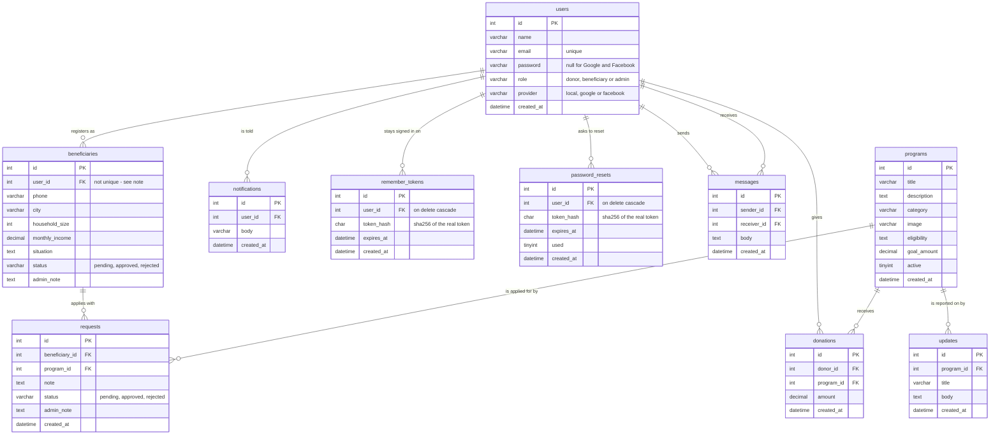

# Entity Relationship Diagram

The ten tables behind HopeBridge. GitHub renders the diagram below directly.

Also exported, for slides and the report:
[erd.png](erd.png) (4144 × 1636) and [erd.svg](erd.svg) (scalable, drops into Word or Docs).

Read from `schema.sql` at commit `eb48c14` — **10 tables, 62 columns, 11 foreign keys**.



Crow's foot notation: the fork is the "many" end.

## How to read it

`users` is the hub — six of the nine other tables reference it directly, and `messages`
references it twice, once as the sender and once as the receiver.

| Group | Tables | What it is for |
| --- | --- | --- |
| The two subjects | `users` `programs` | Everything else connects these two, or describes one of them. |
| Joins that carry data | `donations` `requests` | Each links a person to a programme **and** holds facts of its own — an amount, or a status and the admin's reply. That is why they are tables, not plain link rows. |
| Describes a person | `beneficiaries` `notifications` `remember_tokens` `password_resets` `messages` | Extra detail, sign-in state, and things said to or by a user. |
| Describes a programme | `updates` | The progress reports donors read. |

A request points at `beneficiaries`, not at `users`. A person can only apply for help
through an approved beneficiary profile, and the schema enforces that rather than leaving
it to the code.

## Two things the database allows that the application does not

**A user can have more than one beneficiary profile.** `beneficiaries.user_id` is a foreign
key with no unique constraint, so the database would happily store five profiles for one
person. The application only ever creates one, but nothing stops a bug from creating a
second, and the pages that read the profile use `fetch()` — they would silently pick
whichever came back first. Make the rule the database's:

```sql
ALTER TABLE beneficiaries
  ADD UNIQUE KEY unique_user (user_id);
```

**Deleting a user is refused, except for their tokens.** Only `remember_tokens` and
`password_resets` say `ON DELETE CASCADE`. Every other foreign key to `users` — donations,
notifications, and both sides of messages — has no rule, so MySQL refuses to delete anyone
who has ever donated or been written to. That is a safe default rather than a bug, but it
is currently an accident rather than a decision, and there is no way to close an account at
all. Most charities keep the donation and anonymise the person.

## A note on roles

`users.role` is a `varchar` holding `donor`, `beneficiary` or `admin`. For three fixed roles
this is the right call — a roles table would add a join to every page and buy nothing.
